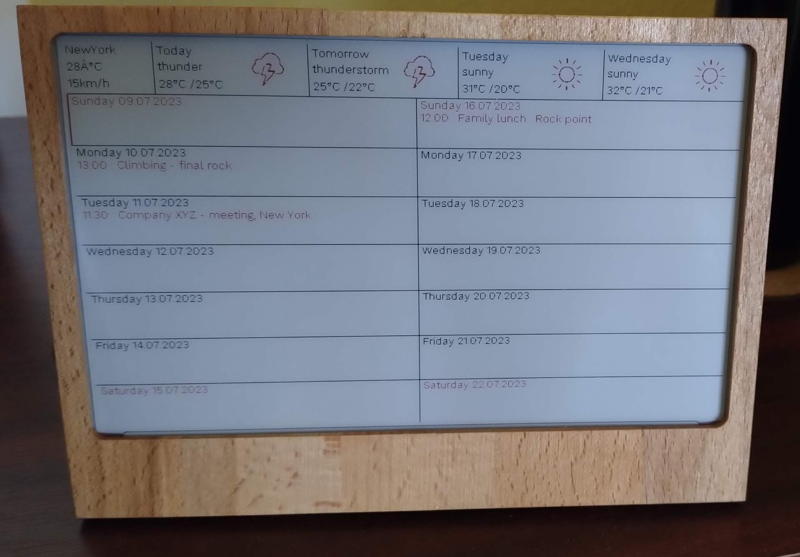

# calendar
Calendar using ics file on waveshare epaper 7,5" display
It is possible to read data from Google and Microsoft 365 calendars

Displays the weather in the given location with a forecast for 3 days

Installation:
 - rename config.py.pattern to config.py
 - a link to the ICS calendar must be added in the "config.py" file
 - in the file "config.py" it is necessary to modify the line with the link to the weather widget

Language:
- en - english
- cs - czech
- de - german

Photo (Wooden frame):

